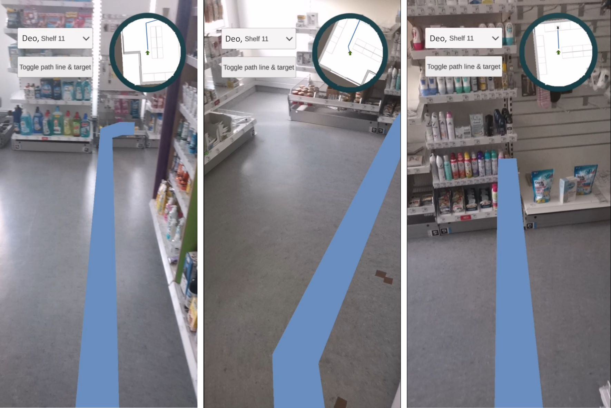
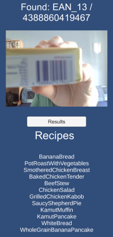
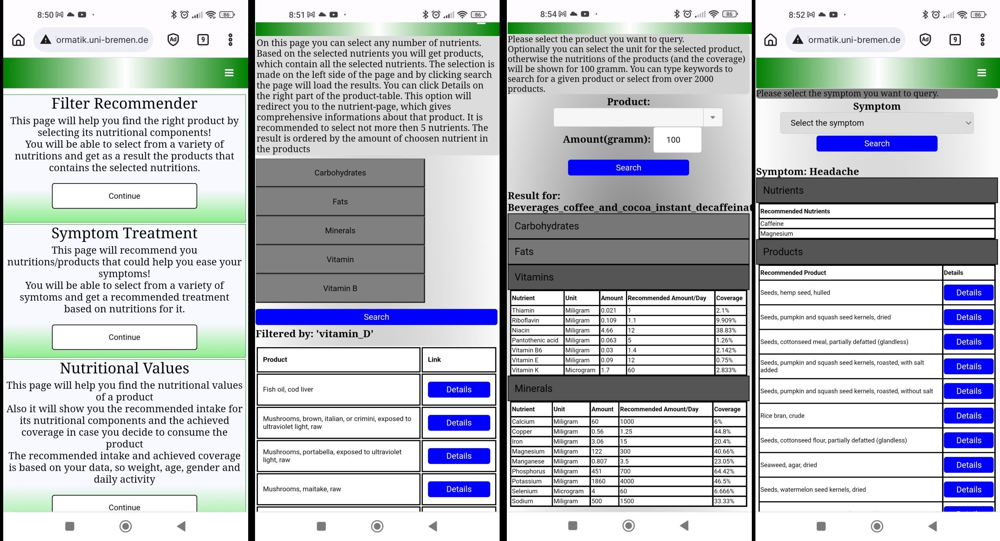

<b>[main](./)</b>

## Applications

Please also check out our web applications on this website: <a href="http://productkg.informatik.uni-bremen.de/">ProductKG web apps</a>

These are some example applications that use the knowledge graph:

<table style="table-layout: fixed;width:100%;">
  <tr>
    <th colspan="2"><h3>Highlighting consumer preferences</h3></th>
  </tr>
  <tr>
    <td style="width:50%;">
Customers have different preferences. Searching for products that meet a given preference like cosmetics that do not contain alcohol can be exhausting. We created an AR application to ease this shopping task.
Based on the product taxonomy, location information in the product location ontology and ingredients information in the ingredients and allergen ontology, we created a consumer preference demo in AR.
      In this demo we used the query for organic products (among others),that can also be found in the predefined queries above.
</td>
  <td style="width:50%;">

  </td>
  </tr>
  <tr>
    <th colspan="2"><h3>Routing to product destination</h3></th>
  </tr>
  <tr>
    <td style="width:60%;">
Customers or store workers often search for product locations. We created an AR demo based on the predefined query for product class locations in order to route a customer to a product destination. On the right it is deployed to a HoloLens.
    </td>
    <td style="width:40%;">

    </td>
  </tr>
  <tr>
    <td style="width:20%;">
The App can also be deployed on a Smartphone.
    </td>
    <td style="width:80%;">

    </td>
  </tr>
   <tr>
    <th colspan="2"><h3>A robot shopping assistant</h3></th>
  </tr>
  <tr>
    <td style="width:40%;">
Customers often search for product locations. We implemented a robot shopping assistant that routes a customer to a product destination by answering complex queries.
    </td>
    <td style="width:60%;">

    </td>
  </tr>
  <tr>
    <th colspan="2"><h3>Highlighting product information</h3></th>
  </tr>
  <tr>
    <td style="width:20%;">
Customers might be interested in product information. We created an AR app for a Smartphone to highlight interesting product information like awarded labels or ingredients. Additionally, products can be added to a shopping cart.
    </td>
    <td style="width:80%;">

      
      
    </td>
  </tr>
     <tr>
    <th colspan="2"><h3>Nutrition recommender</h3></th>
  </tr>
  <tr>
    <td style="width:40%;">
We also created a nutrition recommender website for <a href="http://productkg.informatik.uni-bremen.de/">ProductKG</a> where users can get nutrition recommendation regarding their dietary profile.
    </td>
    <td style="width:60%;">

    </td>
  </tr>
  </table>

<b>[main](./)</b>
